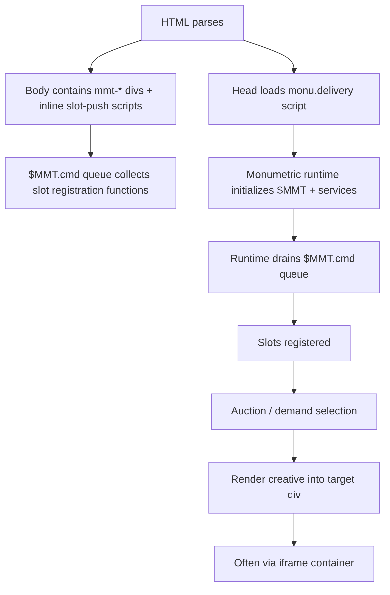

# Monumetric Ad Serving in Ascend on a Next.js Site

## Executive summary

You’re trying to achieve two things at once: (a) get ads consistently serving without breaking UX, and (b) stop your agentic coder from assuming you can “control the ads” like they’re hand-placed, fully deterministic UI components. The evidence you provided, when cross-checked against Monumetric’s public program pages and modern web platform behavior, points to a few key truths:

Monumetric’s **Ascend** program is marketed as _managed ad ops + professional implementation_, where you “work closely” with their onboarding team to choose ad types and build the right mix. It also explicitly says Ascend includes their “Demand Fusion” ad-serving technology, but that does not automatically imply you get the full self-serve control panel that Monumetric markets on the separate DemandFusion product page. citeturn9view0turn8search0turn1search0turn1search3

Your code snippet shows Monumetric uses a command-queue pattern (`$MMT.cmd.push(function(){ ... })`) analogous to other ad stacks (for example Google Publisher Tag’s `googletag.cmd.push`). In those patterns, you typically have (1) a global “engine” script and (2) per-placement containers and/or DOM-based insertion rules. citeturn0search3turn0search2

Pasting the _same_ slot tag repeatedly (especially with the same `id="mmt-..."`) is very likely to create conflicts rather than “50 ads.” HTML `id` values are expected to be unique in a document, and ad stacks that map a slot to a div treat duplicate IDs as an error condition or undefined behavior. citeturn2search10turn0search0turn0search2

Next.js App Router behavior is a legitimate “why are ads not refreshing” suspect: layouts preserve state and do not re-render between route transitions. Third-party scripts that rely on “page load” semantics can fail to reinitialize after client-side navigation unless something triggers re-render/refresh logic. citeturn3search5turn3search3turn2search15

A big portion of your “flicker / jumping / tacky” symptoms is consistent with **CLS**: late-loading ads with no reserved space. web.dev explicitly calls out reserving space for ads via `min-height` and/or `aspect-ratio`, potentially with media queries by form factor. citeturn3search2turn3search0

The rest of this report substantiates those points, connects them directly to your exact Monumetric tags and account tier, and turns it into a non-prescriptive “reference sheet” your coder-agent can use to self-correct and verify reality.

## Evidence from your repo and your provided implementation artifacts

### GitHub repo scan result

You asked to start with the GitHub connector and the repository `cadegallen-prog/HD-ONECENT-GUIDE`. Searches against that repo for likely integration strings (for example `monu.delivery`, `mmt-`, `Monumetric`) did not return matches via the connector’s code search. Practically, that suggests at least one of the following is true:

- the Monumetric integration lives in a different repo (common when a “guide” repo is separate from the production site),
- the integration is injected at runtime (for example through a CMS, hosted config, or edge layer),
- or the repo isn’t indexed for code search in a way that returns results (this happens sometimes with GitHub search tooling depending on indexing state).

Because your agentic coder is confused about “what code exists,” this repo result itself is useful: it discourages endless searching in the wrong place.

### The exact head script and body slot UUIDs you provided

#### Head “engine” script

You provided this exact head script:

```html
<script
  type="text/javascript"
  src="//monu.delivery/site/1/d/65ab12-7f57-43c6-a5b7-76b6b4c6548c.js"
  data-cfasync="false"
></script>
```

Two details in that tag matter for troubleshooting:

- The `monu.delivery` URL indicates the runtime is loaded from Monumetric-controlled infrastructure (so behavior can change without your code changing).
- The `data-cfasync="false"` attribute is a Cloudflare Rocket Loader escape hatch, which Cloudflare documents as “ignore this script” (Rocket Loader won’t reorder/defer it the same way). citeturn2search1

#### Body “placement” slot IDs

From your provided snippet, these are the unique placement identifiers:

- Video Ad: `fd66fcce-8429-428b-b22d-8bac5706a731`
- Sticky Sidebar: `5f725bea-07f8-4fed-b9dd-bb609c80609e`
- Middle Sidebar Flex: `c243b456-5b7f-4065-8c5e-dac26a8978c4`
- Top Sidebar Flex: `b3dc56d1-75b2-4f5b-be74-9a19a17434c1`
- Pillar (Left): `785d6c5a-f971-4fa0-887e-fe0db38eadfd`
- Footer In-screen: `45ff9f95-5cad-4e88-bac8-d55780b1049f`
- In-content Repeatable: `39b97adf-dc3e-4795-b4a4-39f0da3c68dd`
- Header In-screen: `8c9623fb-51f8-48ac-b124-550e1f0b3888`

Your slot tags follow a consistent pattern:

- an empty div like `<div id="mmt-UUID"></div>`
- followed by an inline script that pushes a function onto `$MMT.cmd` and then appends the UUID into a slot list like `$MMT.display.slots.push(["UUID"])` (or, for video, a `$MMT.video.slots.push([...])` variant).

That structure strongly implies a “command queue” that buffers placement requests until the head script is ready.

## How Monumetric’s head script and body tags interact

### The working model to hold in your head

What your tags suggest is this flow:

- The head script loads and initializes a global object (your inline tags do: `$MMT = window.$MMT || {}; $MMT.cmd = $MMT.cmd || [];`).
- Each body placement tag pushes a function onto the queue (`$MMT.cmd.push(function(){ ... })`).
- Once the runtime is ready, it drains that queue, registers each requested slot, runs header bidding / ad selection, then renders into the corresponding container.

This is very similar to how **Google Publisher Tag (GPT)** documents its own queue-based initialization and body container matching: you define/enable in the head, then you display into a specific `<div id="...">` in the body. citeturn0search3turn0search2

### Mermaid flowchart of the likely execution chain



### Iframe vs direct injection

You specifically asked about “iframe vs direct injection.” Two relevant anchors here:

- In your own audits/emails, you referenced elements like `google_ads_iframe_...` and `#google_vignette`, which is the naming convention typically seen in Google-rendered ad iframes / out-of-page formats.
- GPT’s own reference docs discuss “ad container iframes created by PubAdsService” (for example `setAdIframeTitle` explicitly references those iframes), which is explicit primary evidence that at least the Google layer commonly renders into iframes. citeturn0search2

Monumetric also states (in older but still relevant writing) that they use a Google-hosted server for their primary ad server, which makes it plausible that Google ad delivery patterns (including iframes/SafeFrames) are part of the stack. citeturn1search11

So, while Monumetric doesn’t publicly document “$MMT always renders as X,” the combination of (a) your observed DOM naming and (b) Google’s own docs makes “ads frequently render inside iframes” a reasonable expectation.

## Repeatable slots and what happens if you paste “1x vs 50x”

You asked the most important practical question:

If you paste one in-content slot tag once, do you get one ad? If you paste it 50 times, do you get 50 ads? Or will Monumetric cap it / ignore extras?

The most accurate way to think about it is: **a placement tag creates an opportunity, not a guarantee**. Whether it becomes an ad depends on (a) DOM validity, (b) whether the runtime recognizes/configures that slot, and (c) whether demand/fill rules decide to serve.

### Case: one slot tag on a page

If you include one body placement tag once (one `mmt-...` div + one `$MMT.display.slots.push([...])`), the page is advertising “here is one place you’re allowed to render.”

Whether you see exactly one ad depends on whether Monumetric is also running any **auto-insert or out-of-page formats**.

As an analogy, Google’s own “learn the basics” guide notes that “anchor ads” do not require you to define a container: the format “automatically creates and inserts its own container.” citeturn0search5

That’s important because it explains how you can sometimes experience “I didn’t put an ad there, but there’s a sticky/header thing anyway.” Your email thread also strongly suggests Monumetric has placements that are inserted relative to selectors (for example “after nav.sticky,” “after body,” “before every 3rd h2”), which behaves like auto insertion rather than placeholder-only.

### Case: pasting the same slot 50 times with the same `id="mmt-…"`

This is where things are very likely to break or become unpredictable.

Two primary-source reasons:

- MDN’s DOM docs say if an element’s `id` is not the empty string, “it must be unique in a document.” citeturn2search10
- Google Publisher Tag explicitly treats the “same div ID associated with another slot” as an error condition: “Every GPT ad slot must be associated with a unique `<div>` element.” citeturn0search0turn0search2

Even if Monumetric is not literally calling `googletag.defineSlot()` in the way the GPT examples show, the architecture of “slot ↔ div ID mapping” is common, and duplicate IDs are a known source of “it flickers / it disappears / it renders in the wrong place / it only fills the first occurrence” symptoms.

So the simplest non-prescriptive takeaway for your coder-agent is:

- duplicating **the same** `mmt-<UUID>` container tends to be “DOM-invalid + ad-stack-undefined behavior,” not “50 ads.”

### Case: 50 unique slots on one page

If you had 50 **unique** `mmt-<UUID>` IDs, then you’ve created 50 unique opportunities.

Will you get 50 ads? Not necessarily.

A few reasons supported by primary sources:

- GPT recommends that fixed-size ads have a defined `<div>` to prevent layout shift, while multi-size ads need flexibility and only creatives matching eligible sizes are considered in selection. That implies “slot definition” and “what actually serves” are separate steps. citeturn0search4turn0search3
- DemandFusion (as marketed) includes “custom unfilled ad zone solutions” like collapsing the DIV or keeping a shadowbox. That explicitly acknowledges that some zones will be unfilled and the system decides how they behave. citeturn1search0turn8search16
- DemandFusion also describes “Ad SmartZones” where multiple ad units can function in one zone under constraints, which strongly implies that “number of DOM anchors” is not the only determinant of “number of ads shown.” citeturn1search0

A reasonable way to phrase it for your agentic coder is:

- “Adding more unique placements increases potential serving, but actual serving tends to be constrained by Monumetric configuration, fill/demand, and any guardrails like unfilled behavior and SmartZone logic.”

## Ascend vs DemandFusion controls and who likely controls what

### Verified corrections to prior assumptions

A key confusion in earlier AI responses was equating:

- “Ascend includes Demand Fusion technology”  
  with
- “Ascend gives the publisher full DemandFusion self-serve interface.”

Monumetric’s public pages show a more nuanced picture:

- The Ascend page explicitly says Ascend was designed so you can “work closely with our onboarding team to create the ad-setup for your goals,” choose ad types on desktop/mobile, and that your site “will also receive our industry-leading ad-serving technology, Demand Fusion.” citeturn9view0
- Monumetric’s homepage positions DemandFusion as its own product category: “DemandFusion: Publishers with Direct DSP Relationships… self-serve managed header bidder platform.” citeturn1search1turn8search0
- The DemandFusion product page markets “complete control,” “no developers… required,” and lists many knobs (device strategy, elaborate refresh control, SmartZones, unfilled choices, sponsored post rules). citeturn1search0turn8search16

Taken together, that supports this interpretation:

- In Ascend, you may be running on DemandFusion-grade tech under the hood. citeturn9view0
- The depth of the knobs exposed to you in the console UI may be limited compared to what the standalone DemandFusion product page describes. citeturn8search0turn1search0turn1search1

This lines up with your observed reality: you mainly see unfilled/CLS options like “collapse vs shadowbox,” not the full matrix of refresh caps and partner-level floors.

### Control mapping table (publisher-side vs Monumetric-side)

This table uses phrasing like “tends to be” and “often,” because the exact split can vary by how Monumetric configured your account and by what they expose in your console.

| Topic                                              | Often publisher-side (site code / CSS / deployment)                                                      | Often Monumetric-side (account config / managed ad ops)                                               | Notes grounded in sources                                                                                                                                                                           |
| -------------------------------------------------- | -------------------------------------------------------------------------------------------------------- | ----------------------------------------------------------------------------------------------------- | --------------------------------------------------------------------------------------------------------------------------------------------------------------------------------------------------- |
| Whether the Monumetric runtime loads               | Yes (you control whether the head script exists on the page)                                             | Indirectly (they can pause/change config, but your script insertion is the physical “on switch”)      | Third-party script behavior depends on being present and loading in correct order. citeturn2search15turn2search1                                                                                |
| Where “in-content” ads can appear                  | Yes (you control your content structure, headings, containers, spacing)                                  | Yes (they can configure insertion rules like “before every 3rd h2” or rely on provided tags)          | Ascend is described as a collaborative ad-setup process. citeturn9view0                                                                                                                          |
| Ad formats (sticky, in-screen, interstitial, etc.) | Limited (you can remove certain anchors or hide containers, but some formats create their own container) | Strong (they enable/disable formats and placements)                                                   | Ascend explicitly says you can choose from featured ad types during setup. citeturn9view0turn1search3; Out-of-page formats can create their own container (anchor example). citeturn0search5 |
| Refresh configuration                              | Sometimes limited UI; site code can affect whether refresh triggers occur (SPA navigation)               | Generally strong control in managed ad ops; DemandFusion product markets refresh caps/triggers/floors | DemandFusion marketing explicitly highlights “Elaborate control over ad Refresh.” citeturn1search0                                                                                               |
| Unfilled behavior (collapse vs shadowbox)          | Limited (CSS can mimic placeholders, but true behavior may be set in config)                             | Likely configurable on Monumetric side; may be exposed to you as a small set of options               | DemandFusion marketing lists “collapse DIV” vs “shadowbox.” citeturn1search0                                                                                                                     |
| Ad density outcomes                                | Page markup affects how many placements exist; CSS affects how many are visible at once                  | Strong influence via what placements are configured and allowed, SmartZones strategies                | DemandFusion marketing references SmartZones for multiple units in one zone and keeping behavior stable across refreshes. citeturn1search0                                                       |

## Next.js SPA behavior plus CSP and Cloudflare interactions

This section ties together three “invisible” forces that can make ads look mysteriously broken: SPA navigation, CSP, and Cloudflare script optimization.

### Next.js: layouts don’t re-render on navigation

Next.js App Router docs explicitly say layouts “preserve state, remain interactive, and do not re-render” on navigation. citeturn3search5turn3search3

That’s beneficial for UX, but it can be adversarial to third-party ad stacks that assume:

- a full page load will occur,
- DOM will be rebuilt from scratch,
- initialization will run again.

If Monumetric expects certain DOM events or page lifecycle semantics on navigation, a Next.js site can produce symptoms like:

- “ads don’t refresh when moving between pages”
- “slot stays blank unless I hard refresh”
- “it works on first load, then breaks”

Mitigations in real-world SPA ad integrations often revolve around detecting route changes and triggering some form of “reinitialize ads for newly rendered content,” but what the best hook is depends on what Monumetric exposes and how your components are structured.

Next.js’s script guidance also recommends including third-party scripts in specific pages/layouts to minimize performance impact, and documents script loading strategies (`beforeInteractive`, `afterInteractive`, etc.). Those strategies can affect whether an ad runtime is ready before inline placement tags run. citeturn2search15turn2search14

### CSP: inline slot tags can be blocked silently

Your slot tags rely on inline `<script>` blocks (`$MMT.cmd.push(function(){...})`). CSP commonly blocks inline scripts by default unless you allow them via:

- `'unsafe-inline'`, or
- a per-request nonce (`'nonce-...'`), or
- a hash allowlist. citeturn2search0turn2search12

This matters because it creates a very specific failure mode:

- The head script loads fine (external `src=...`).
- The inline slot scripts are blocked by CSP.
- Result: the runtime never sees your `$MMT.display.slots.push(...)` calls, so in-content placements appear “dead” even though the global script is present.

MDN’s practical CSP guidance also notes that if you use a CSP `<meta http-equiv="Content-Security-Policy" ...>`, it should appear very early in `<head>`, and recommends testing with Report-Only first. citeturn2search13

### Cloudflare Rocket Loader: script reordering/defer can produce flicker

Cloudflare documents `data-cfasync="false"` as the way to have Rocket Loader ignore a script tag. It also emphasizes that dependencies may need the same exemption and that the `data-cfasync` attribute must be present in the HTML tag (you can’t add it later in JS and expect Rocket Loader to notice). citeturn2search1

Because your Monumetric script explicitly includes `data-cfasync="false"`, it looks like Monumetric is already anticipating (or has run into) Rocket Loader changing the order/timing of execution.

This is relevant to “flicker” because reordering/defer can cause:

- the page to render,
- then ad code to execute late,
- then layout to shift,
- which web.dev documents as a common CLS pathway with late-loading content like ads. citeturn3search2

## Mobile-first best practices and example CSS for iOS and Android

Given your traffic is 85–90% mobile, the best “bang for effort” tends to come from stabilizing layout first, then letting the ad system fill within stable containers.

### Stabilize layout to reduce flicker and CLS

web.dev explicitly recommends reserving space for late-loading content such as ads using `min-height` and/or `aspect-ratio`, and notes you may need media queries to account for differing ad sizes across form factors. citeturn3search2turn3search0

MDN documents the `aspect-ratio` property and how it gives a preferred width/height ratio even as the viewport changes. citeturn3search0

### Handle notches and home indicators for sticky footers on iOS

MDN documents CSS `env()` and specifically notes `safe-area-inset-bottom` can prevent fixed toolbars/buttons from being obscured on iOS-style device UI regions. citeturn3search7

### Example CSS patterns (non-prescriptive starting points)

These are intentionally “example scaffolds” and not canonical requirements. Many sites tune these values based on which ad sizes they actually see in production.

```css
/* Generic wrapper around any Monumetric slot container */
.mmt-slot {
  /* Keep the slot from collapsing to 0px height while ads load */
  min-height: 50px;
  width: 100%;
  /* Helps center fixed-width creatives on larger phones/tablets */
  display: flex;
  justify-content: center;
  align-items: flex-start;
}

/* Common in-content rectangle slot: reserve space to reduce CLS */
.mmt-slot--rect {
  min-height: 250px; /* common baseline for 300x250-class units */
}

/* Banner-ish slots: reserve space for 320x50 / 320x100 / 728x90 class units */
.mmt-slot--banner {
  min-height: 50px;
}

/* If you observe “bigger” banners frequently, a second tier can help */
@media (min-width: 360px) {
  .mmt-slot--banner {
    min-height: 100px;
  }
}

/* Desktop/tablet: if you actually serve 728x90, reserve accordingly */
@media (min-width: 768px) {
  .mmt-slot--banner {
    min-height: 90px;
  }
}

/* Sticky footer container pattern with safe-area padding */
.mmt-sticky-footer {
  position: fixed;
  left: 0;
  right: 0;
  bottom: 0;

  /* iOS safe-area protection */
  padding-bottom: env(safe-area-inset-bottom);

  /* Avoid covering content: use your own layout padding elsewhere */
  z-index: 1000;
}
```

Why these patterns map to your symptoms:

- Reserving height tends to reduce “appear, disappear, jump, flicker” motion caused by late ad iframes entering the flow. citeturn3search2
- `aspect-ratio` can be swapped in when you want a ratio-based reserve rather than a fixed `min-height`. citeturn3search0
- Sticky footers that don’t account for safe area can feel “broken” on iPhones with home indicator UI. citeturn3search7

## Verification checklist, escalation template, and email correspondence assessment

### A non-prescriptive verification checklist your agentic coder can run

Because your coder-agent can use Playwright, a “trust but verify” checklist tends to be more reliable than arguing about what Monumetric is doing.

A typical verification pass might include:

- **Rendered DOM audit**
  - confirm whether the Monumetric head script is present exactly once
  - confirm whether each `div#mmt-<UUID>` actually exists on the page
  - confirm whether any slot containers are duplicated (duplicate HTML `id` is a red flag). citeturn2search10

- **Console log scan**
  - look for CSP violations, especially “Refused to execute inline script…” which would block `$MMT.cmd.push(...)`. citeturn2search0
  - look for “script blocked” messages around `monu.delivery`, `securepubads.g.doubleclick.net`, or quality tools.

- **Network request sanity**
  - confirm `monu.delivery` loads successfully
  - confirm downstream ad-stack calls occur after it loads
  - verify whether scripts are being deferred/reordered by performance tooling (Cloudflare Rocket Loader interactions are a common culprit; `data-cfasync="false"` is relevant). citeturn2search1

- **Route-transition tests**
  - test a cold load vs client-side navigation between routes
  - compare whether new in-content placements get filled after navigation, given that Next.js layouts do not re-render on navigation. citeturn3search5turn3search3

- **CLS-focused trace**
  - do before/after measurements on pages that visibly “jump”
  - verify whether space reservation reduces CLS, as web.dev recommends for late-loading content like ads. citeturn3search2

### Escalation email template to Monumetric

This is written so your agent can fill in evidence. It’s intentionally “suggestive”—it doesn’t assume Monumetric is at fault, it just asks for concrete checks.

**Subject:** PennyCentral Ascend: Ad Serving Instability on Mobile + Next.js Route Refresh Behavior (screenshots + trace attached)

**Body:**
Hi Monumetric Publisher Success / Implementation Team,

We’re seeing persistent ad-serving issues on `pennycentral.com` after enabling ads for testing.

Observed symptoms (examples attached):

- Mobile UX interference (header/nav overlap or sticky behavior).
- Flicker / repeated blanking / apparent refresh loops.
- In-content placements inconsistent after client-side navigation (Next.js App Router style routing).

Implementation notes:

- Head script present: `//monu.delivery/site/1/d/65ab12-7f57-43c6-a5b7-76b6b4c6548c.js` (loaded once).
- Slot UUIDs on page(s): [list which UUIDs are present on which routes].
- We have Cloudflare; scripts include `data-cfasync="false"`.

Evidence attached:

- Mobile screen recording(s)
- Playwright screenshots on mobile + desktop
- Console logs showing any CSP violations/errors
- Network log/HAR showing monu.delivery + downstream requests
- CLS trace for affected views

Questions / requests for confirmation:

- Which placements are currently enabled per device (especially mobile) and per route?
- Whether any placements are auto-inserted by DOM selector rules (ex: “insert before every nth heading”) versus requiring our placeholders.
- Confirm the actual refresh interval and whether overrides are enabled.
- Any recommended changes for SPA/Next.js navigation so ads reinitialize safely without interfering with header navigation.

Thanks,
Cade

### Objective assessment of your email correspondence with Monumetric reps

This is based on the email export you provided (Monumetric.json) and focuses on expectations, responsiveness, and technical clarity.

**Your expectations (stated clearly in your messages):**

- “No mobile header/nav interference.”
- “Interstitial/vignette off.”
- “Video/autoplay off.”
- “/report-find excluded.”
- “Refresh no faster than 60 seconds.”
- “Controlled placement: in-content + footer only for certain routes.”
- Requests for exact confirmation and propagation timing.

**Monumetric’s observed responses:**

- **Emergency channel (emergency@monumetric.com): below expectations**
  - You escalated with a genuine functional outage (“mobile site unusable”), but the usable technical response appears to have come later via the success/implementation pathway rather than an immediate, direct emergency fix response in-thread. (The weekend “sorry we missed you” autoresponder does at least provide a process and points to emergency@ for outages, but it doesn’t resolve the problem.) This is not necessarily negligence, but relative to “emergency” expectations it under-delivers.

- **Samantha (sales / Publisher Success Associate): meeting expectations early, then below expectations on “fixed” assurance**
  - Strengths: She relayed a concrete blocker (CSP allowlist additions including Google ad-serving endpoints), which is useful and specific.
  - Weakness: She communicated that the mobile header in-screen was updated so it wouldn’t cover navigation, but you later reproduced the same failure mode and Monumetric ultimately concluded the header in-screen “does not really work for your site” and removed it on mobile. That gap between “fixed” and “still broken” is where expectations were not met.

- **Amy (Publisher Success Associate): meeting expectations for acknowledgment, below expectations for technical specificity**
  - Strength: She acknowledged and routed the issue to implementation.
  - Weakness: Your explicit requests included “what device/browser was used,” “what changes were made,” and a “stable environment / limited test,” but her initial response was mainly a handoff.

**Net assessment:** Your messages were unusually clear and technically grounded for a publisher, and they repeatedly asked for verifiable reality. Monumetric’s responses improved when implementation provided details (like disabling specific placements and describing why header in-screen conflicted with your layout), but earlier “it’s fixed” messaging did not align with what you saw in production. That mismatch is the main driver of your justified frustration.

If you want to integrate this assessment into your agentic coder note, the most useful “lesson” is: **treat any fix confirmation as provisional until Playwright evidence confirms it on real routes/devices**, especially in a Next.js environment where navigation and layout behavior differs from WordPress-style full reload pages. citeturn3search5turn2search15
